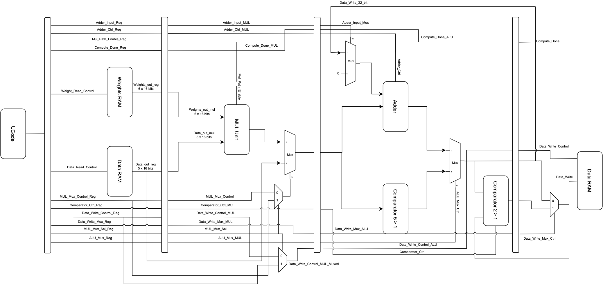
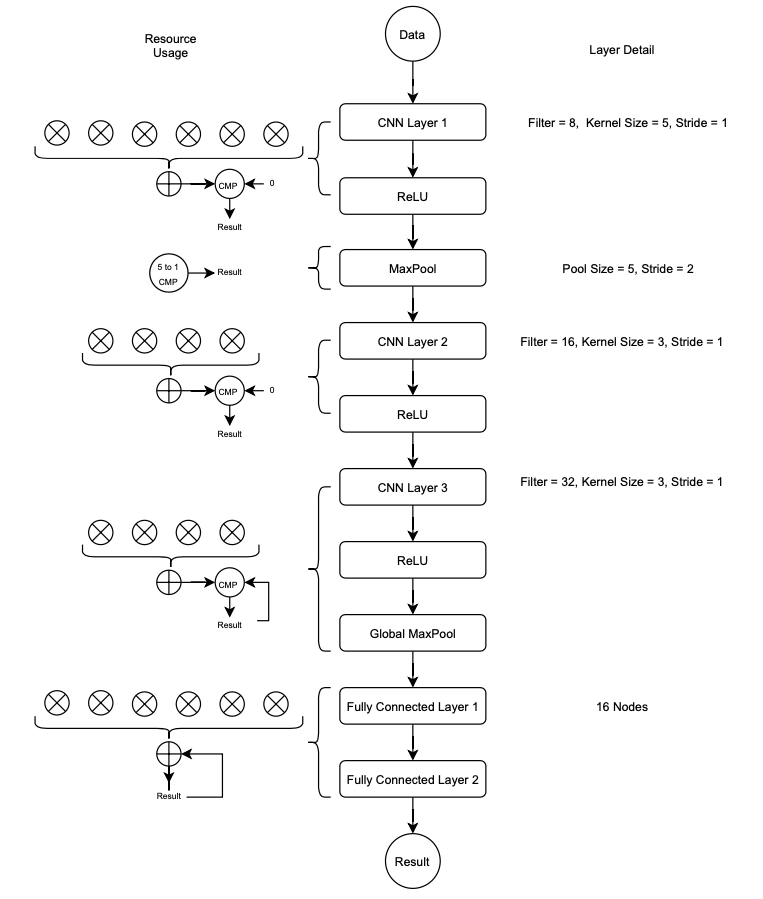

Jul 2021 - May 2022
# Lightweight ECG Classifier for Edge Computing

Continuous cardiac monitoring with wearable sensors can help patients respond immediately to cardiac emergencies, especially with ML models that can autonomously diagnose ECG readings. However, most ML models require large computational resources, thus the ECG data needs to be sent from the wearable sensor to a phone or the cloud. Data transmission is power intensive, reducing the sensor's battery life.

This project aims to develop a lightweight ECG Classifier and deploy it on an FPGA (CMOD A7) that is small enough to be embedded on a wearable sensor, so that ECG diagnosis can be performed on the device itself. The device can then alert patients of an emergency. This greatly extends the device battery life. The model was trained to predict Atrial Flutter (AFl) from a single ECG tracing, and the results are as follows:
```
Sensitivity (True-Positive): 80.4%
Specificity (True-Negative): 73.3%
```
Refer to this README for a summary of the implementation, or view the notebooks for in-depth description. The folder "Model Building" contains the files pertaining to the development of the CNN model with tensorflow, while the folder "Model Deployment" pertains to the codes to deploy the model on an FPGA.

## Model Building - Data & Preprocessing

A total of 121,149 12-Lead ECG tracings from different countries were obtained from the following open-source databases:
```
1. CPSC Database: 13,256
2. INCART Database: 74
3. PTB and PTB-XL Database: 22,353
4. Georgia ECG Database: 20,672
5. Chapman-Shaoxing and Ningbo Database: 45,152
6. UMich Database: 19,642
```
The data can be downloaded from https://physionetchallenges.org/2021/.

The preprocessing steps included reading the ECG metadata from the associated .mat files, before filtering out tracings which had unsuitable lenghts or data formats. As the actual ECG data files were large, only the filepaths and metadata was used to preprocess the data. A DataFrame of the final dataset was constructed that included the filepath and the labels for the 4 conditions mentioned, and then saved into the CSV file "full_dataset.csv".

## Model Building - Training and Analysis

A 3-layer CNN Model with (8, 16, 32) filters respectively was constructed and trained on 1-Lead ECG tracings. The total number of parameters was kept under 2,600 to ensure it can fit on a lightweight FPGA.

Once the model reached sufficient accuracy after hyper-parameter tuning (>75% accuracy), the entire lists of weights and biases of each layer had to be printed out and saved into a text file for model deployment on the FPGA.

## Model Deployment - High Level Description

The high level architecture of the model implementation on the FPGA is as shown:



Essentially, the implementation consists of a read-only memory for weights (which we hard-code based on the generated weights from the Python CNN model) and a computing unit with multipliers, adders, and comparators for the CNN calculations. A unique feature of CNNs is that it only requires those 3 operations to give an inference, making computations very easy to implement. The diagram below shows the operation flow:



## Model Deployment - Relavant Files

The folders in "Model Development" contain the following information:
```
"final_implementation": full vivado file for the CNN implemenation on the FPGA
"verilog_code": verilog codes without the need to open vivado
"testing": sample inputs to test the CNN predictions. the ground truth is labelled in the file name.
"dev_files": files for testing the intermediate steps to the final implementation
```